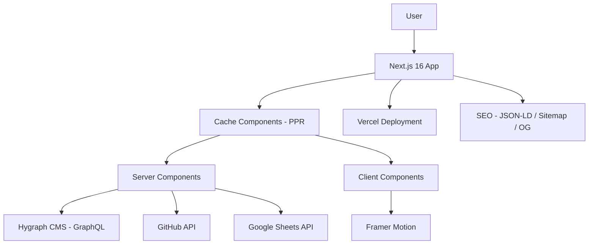

# Padmanabha Das - Modern Portfolio

<div align="center">

[](https://nextjs.org/)
[](https://reactjs.org/)
[](https://typescriptlang.org/)
[](https://tailwindcss.com/)
[](https://vercel.com/)

A production-grade portfolio built with **Next.js 16**, **React 19**, and **TypeScript**, featuring Cache Components (PPR), CMS-driven content, GitHub integration, and structured data for SEO.

[🌐 **Live Demo**](https://padmanabha-portfolio.vercel.app) · [📋 **Report Bug**](https://github.com/chayan-1906/Padmanabha-Portfolio/issues) · [✨ **Request Feature**](https://github.com/chayan-1906/Padmanabha-Portfolio/issues)

[](https://github.com/chayan-1906/Padmanabha-Portfolio/stargazers)
[](https://github.com/chayan-1906/Padmanabha-Portfolio/network/members)

</div>

---

## Overview

A full-stack portfolio website showcasing my journey as a **Full-Stack Developer** specializing in **Next.js 16**, **React 19**, **React Native**, **Flutter**, and **AI integration** through Model
Context Protocol (MCP) development.

### 🏆 **Key Highlights**

- **3+ years** of professional development experience
- **300+ active users** across deployed applications
- **Real-time systems** and **AI-powered solutions**
- **Cross-platform expertise** in web and mobile development

---

## 🛠️ **Tech Stack**

<div align="center">

### Frontend


### UI & Animation


### Data & APIs


</div>

---

## ✨ Features

### 🎨 **Modern Design System**

- **Dual Theme Support** - Seamless light/dark theme switching with system preference detection
- **Responsive Design** - Optimized for desktop, tablet, and mobile devices
- **Smooth Animations** - Powered by Framer Motion with staggered, scroll-triggered, and hover animations
- **Custom CSS Variables** - Dynamic theming with Tailwind CSS 4

### Cache Components (PPR)

- **Partial Pre-Rendering** - Combines static and dynamic rendering using Next.js 16 Cache Components
- **Tag-Based Revalidation** - Granular cache invalidation via `cacheTag` and `updateTag`
- **Suspense Boundaries** - Progressive rendering with skeleton loading states
- **Webhook Integration** - Hygraph webhooks trigger instant cache revalidation on content publish

### SEO

- **JSON-LD Structured Data** - Person, WebSite, and ProfilePage schemas for rich search results
- **Dynamic Sitemap** - Auto-generated `sitemap.xml` via Next.js file convention
- **Robots.txt** - Crawler directives with sitemap reference
- **OpenGraph & Twitter Cards** - Rich social sharing previews with generated OG images
- **Per-Page Metadata** - Custom title and description for each route

### Data Architecture

- **Hygraph CMS** - Headless CMS for all portfolio content with multi-portfolio support
- **GitHub API** - Live repository data enrichment (stars, forks, topics, collaborators)
- **Google Sheets API** - Contact form submissions and page analytics tracking
- **GraphQL** - Efficient data fetching with parallel `Promise.all` queries

---

## 🏗️ **Architecture**



---

## 🖼️ Screenshots

<details>
<summary><strong>Hero Section</strong></summary>

Experience the modern, animated landing page with a dynamic tech stack display and social links.

<div align="center">

**Desktop - Light Theme**


**Desktop - Dark Theme**


**Mobile Responsive**


</div>
</details>

<details>
<summary><strong>Skills & Experience</strong></summary>

Interactive skill categories with progress indicators and a comprehensive work timeline.

<div align="center">

**Skills Section**


**Experience Timeline**


</div>
</details>

<details>
<summary><strong>Projects Showcase</strong></summary>

GitHub-integrated project display with categorization and live data synchronization.

<div align="center">

**Featured Projects**


**Project Categories - Web Development**


**Project Categories - MCP Development**


**Mobile Projects View**


</div>
</details>

<details>
<summary><strong>Contact & Education</strong></summary>

Functional contact form with Google Sheets integration and academic background display.

<div align="center">

**Contact Form - iPad**


**Education Section**


</div>
</details>

---

## 📁 **Project Structure**

```
src/
├── app/
│   ├── globals.css              # Global styles with CSS variables
│   ├── layout.tsx               # Root layout with metadata and theme provider
│   ├── page.tsx                 # Home page with JSON-LD structured data
│   ├── sitemap.ts               # Auto-generated sitemap.xml
│   ├── robots.ts                # Crawler directives
│   ├── opengraph-image.tsx      # Dynamic OG image generation
│   ├── api/
│   │   ├── contact/route.ts     # Contact form submission endpoint
│   │   └── revalidate/route.ts  # Webhook cache revalidation endpoint
│   └── projects/
│       └── page.tsx             # All projects page with categorization
├── components/
│   ├── ui/                      # Reusable UI components (Button, Skeleton, GradientButton)
│   ├── hero/                    # Hero section (server + client)
│   ├── about/                   # About section
│   ├── skills/                  # Skills showcase with progress bars
│   ├── experiences/             # Work experience timeline
│   ├── educations/              # Education cards
│   ├── projects/                # Project grid and cards
│   ├── certifications/          # Certification cards
│   ├── contact/                 # Contact form with validation
│   ├── footer/                  # Footer with navigation
│   ├── navigation/              # Fixed navbar with theme toggle
│   ├── cta/                     # Call-to-action sections
│   ├── loading/                 # Skeleton loading states (Home, Projects)
│   ├── analytics/               # Server-side analytics tracker
│   ├── theme-provider.tsx       # next-themes wrapper
│   └── theme-toggle.tsx         # Theme switcher dropdown
├── lib/
│   ├── hygraph.ts               # Hygraph GraphQL queries with Cache Components
│   ├── github.ts                # GitHub API integration with caching
│   ├── google-sheets.ts         # Google Sheets append for forms and analytics
│   ├── analytics.ts             # Page analytics with geolocation tracking
│   └── utils.ts                 # cn() and utility functions
├── types/                       # TypeScript type definitions
├── constants/                   # App constants and static data
└── config/
    └── config.ts                # Environment variable exports
```

---

## 🚀 Getting Started

### Prerequisites

- Node.js 18+
- npm

### Installation

1. **Clone the repository**

   ```bash
   git clone https://github.com/chayan-1906/Padmanabha-Portfolio.git
   cd Padmanabha-Portfolio
   ```

2. **Install dependencies**

   ```bash
   npm install
   ```

3. **Environment Setup**

   ```bash
   cp .env.example .env
   ```

   Update your `.env` file with the following variables:

   ```env
   GITHUB_TOKEN=your_github_personal_access_token
   HYGRAPH_ENDPOINT=your_hygraph_content_api_endpoint
   HYGRAPH_TOKEN=your_hygraph_permanent_auth_token
   REVALIDATE_SECRET=your_webhook_secret_key
   SITE_URL=your_deployed_portfolio_url
   GOOGLE_CREDENTIALS=your_google_service_account_json
   ```

4. **Run development server**

   ```bash
   npm run dev
   ```

5. **Open** [http://localhost:3000](http://localhost:3000)

---

## Cache Revalidation

The portfolio uses **Cache Components** with tag-based revalidation. Hygraph webhooks trigger the revalidation endpoint to refresh cached content instantly.

### Webhook Configuration

```
Endpoint: https://your-domain.com/api/revalidate?secret=your_secret
Method: POST
Trigger: Content publish/update events
```

### Cache Tags

| Tag                 | Content                              |
|---------------------|--------------------------------------|
| `personal-info`     | Name, title, bio, contact details    |
| `tech-stacks`       | Technology display in hero           |
| `sections`          | Section metadata (titles, subtitles) |
| `skills`            | Skill categories and levels          |
| `work-experiences`  | Employment history and roles         |
| `educations`        | Academic background                  |
| `featured-projects` | Home page project showcase           |
| `all-projects`      | Projects page full listing           |
| `certifications`    | Professional certifications          |
| `social-links`      | Social media profile links           |
| `github-repos`      | GitHub repository data               |
| `github-user-stats` | GitHub user profile stats            |

---

## 🗄️ Hygraph Schema

<details>
<summary><strong>View full schema</strong></summary>

```graphql
type Section {
  name: String!          # Unique section identifier
  title: String!         # Display heading
  subtitle: String!      # Section description
  order: Int!            # Sort order
  portfolioId: Enum!     # Multi-portfolio support
}

type PersonalInfo {
  name: String!
  title: String!         # Job title
  description: String!   # SEO description
  subtitle: String!
  email: String!
  phone: String!
  github: String!        # GitHub profile URL
  linkedin: String!
  location: String!
  company: String!
  bio: String!
  avatar: Asset!         # Profile image
  resumeUrl: String
  portfolioId: Enum!
}

type Skill {
  name: String!
  level: Int!            # Proficiency percentage
  icon: String!          # react-icons name
  category: SkillCategory
  order: Int!
  portfolioId: Enum!
}

type SkillCategory {
  title: String!
  icon: String!
  gradient: String!      # CSS gradient class
  color: String!
  order: Int!
}

type TechStack {
  name: String!
  order: Int!
  portfolioId: Enum!
}

type WorkExperience {
  company: String!
  icon: String!
  logo: Asset!
  location: String!
  period: String!
  color: String!
  role: [Role!]          # Multiple roles per company
  order: Int!
  portfolioId: Enum!
}

type Role {
  title: String!
  period: String!
  type: String!          # Full-time, Intern, etc.
  description: String!
  achievements: String!
  order: Int!
}

type Education {
  degree: String!
  institution: String!
  logo: Asset!
  location: String!
  period: String!
  cgpa: String!
  highlights: String!
  order: Int!
  portfolioId: Enum!
}

type Project {
  title: String!
  githubUrl: String!
  logoUrl: String!
  actionUrl: String!     # Live demo / download link
  actionType: Enum!      # Demo, Download, Guide, etc.
  featured: Boolean!
  order: Int!
  projectCategory: ProjectCategory
  portfolioId: Enum!
}

type ProjectCategory {
  title: String!
  icon: String!
  gradient: String!
  order: Int!
}

type Certification {
  name: String!
  issuer: String!
  date: Date!
  credentialId: String!
  url: String!
  order: Int!
  portfolioId: Enum!
}

type SocialLink {
  name: String!
  url: String!
  icon: String!          # react-icons name (FaGithub, FaDev, etc.)
  order: Int!
  portfolioId: Enum!
}
```

</details>

---

## 📱 Responsive Design

The portfolio is fully responsive across all device types:

- **Desktop** (1920px+) - Full featured experience
- **Tablet** (768px-1919px) - Optimized layouts
- **Mobile** (320px-767px) - Touch-friendly interface

---

## 🤝 Contributing

If you find this project useful, consider giving it a star! For suggestions or issues:

1. Open an issue for bugs or feature requests
2. Fork the repository for contributions
3. Create pull requests with clear descriptions

---

## 👨‍💻 **About the Developer**

<div align="center">

**Padmanabha Das**

*Full-Stack Developer | AI Integration Specialist*

[](mailto:padmanabhadas9647@gmail.com)
[](https://github.com/chayan-1906)
[](https://www.linkedin.com/in/padmanabha-das-59bb2019b/)
[](https://dev.to/chayan-1906)
[](https://medium.com/@chayan-1906)

</div>

### Professional Highlights

- 🎯 **3+ years** of full-stack development experience
- 🚀 **300+ active users** across deployed applications
- 🤖 **AI integration specialist** with MCP development expertise
- 📱 **Cross-platform developer** in React Native & Flutter

---

## 🙏 **Acknowledgments**

- [Next.js](https://nextjs.org/) - React framework with Cache Components
- [Vercel](https://vercel.com/) - Deployment platform
- [Tailwind CSS](https://tailwindcss.com/) - Utility-first styling
- [Framer Motion](https://www.framer.com/motion/) - Animation library
- [Hygraph](https://hygraph.com/) - Headless CMS

---

*Built with Next.js 16, React 19, and modern web technologies.*
