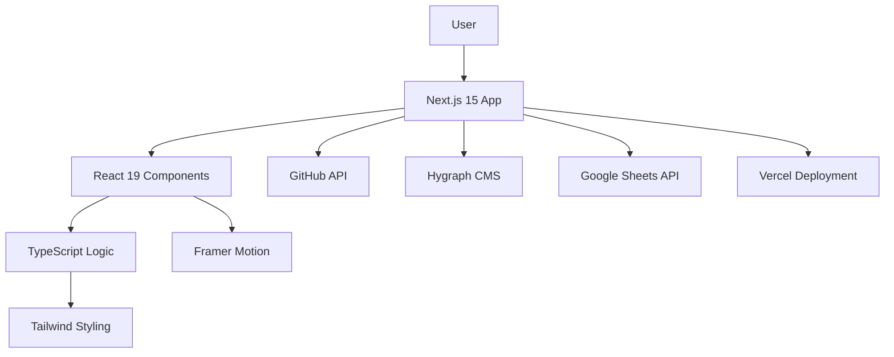

# 🚀 Padmanabha Das - Modern Portfolio

<div align="center">

[](https://nextjs.org/)
[](https://reactjs.org/)
[](https://typescriptlang.org/)
[](https://tailwindcss.com/)
[](https://vercel.com/)

A cutting-edge portfolio website built with **Next.js 15**, **React 19**, and **TypeScript**, featuring dynamic content management, GitHub integration, and sophisticated animations.

[🌐 **Live Demo**](https://padmanabha-portfolio.vercel.app) · [📋 **Report Bug**](https://github.com/chayan-1906/Padmanabha-Portfolio/issues) · [✨ **Request Feature**](https://github.com/chayan-1906/Padmanabha-Portfolio/issues)

</div>

---

## 🎯 **Overview**

This modern portfolio website represents the perfect blend of aesthetic design and technical excellence. Built to showcase my journey as a **Full-Stack Developer** specializing in **Next.js 15**, *
*React.js 19**, **React Native**, **Flutter**, and **AI integration** through Model Context Protocol (MCP) development.

### 🏆 **Key Highlights**

- **3+ years** of professional development experience
- **300+ active users** across deployed applications
- **Real-time systems** and **AI-powered solutions**
- **Cross-platform expertise** in web and mobile development

---

## ✨ Features

### 🎨 **Modern Design System**

- **Dual Theme Support** - Seamless light/dark theme switching with system preference detection
- **Responsive Design** - Optimized for desktop, tablet, and mobile devices
- **Smooth Animations** - Powered by Framer Motion for engaging user interactions
- **Custom CSS Variables** - Dynamic theming with Tailwind CSS 4

## 🛠️ **Tech Stack**

<div align="center">

### **Frontend**


### **UI & Animation**


### **Data & APIs**


</div>

---

## 🏗️ **Architecture Overview**



---

## 🖼️ Screenshots

### Hero Section

Experience the modern, animated landing page with a dynamic tech stack display and social links.

<div align="center">
	<div>
		<h2>Desktop - Light Theme</h2>
		
	</div>
	<div>
		<h2>Desktop - Dark Theme</h2>
		
	</div>
	<div>
		<h2>Mobile Responsive</h2>
		
	</div>
</div>

### Skills & Experience

Interactive skill categories with progress indicators and a comprehensive work timeline.

<div align="center">
	<div>
		<h2>Skills Section</h2>
		
	</div>
	<div>
		<h2>Experience Timeline</h2>
		
	</div>
</div>

### Projects Showcase

GitHub-integrated project display with categorization and live data synchronization.

<div align="center">
	<div>
		<h2>Featured Projects</h2>
		
	</div>
	<div>
		<h2>Project Categories - Web Development</h2>
		
	</div>
	<div>
		<h2>Project Categories - MCP Development</h2>
		
	</div>
	<div>
		<h2>Mobile Projects View</h2>
		
	</div>
</div>

### Contact & Education

Functional contact form with Google Sheets integration and academic background display.

<div align="center">
	<div>
		<h2>Contact Form - iPad</h2>
		
	</div>
	<div>
		<h2>Education Section</h2>
		
	</div>
</div>

## 🛠️ Tech Stack

### **Frontend**

- **Next.js 15** - React framework with App Router
- **React 19** - Latest React features and optimizations
- **TypeScript** - Type-safe development
- **Tailwind CSS 4** - Utility-first styling with custom theming
- **Framer Motion** - Advanced animations and transitions

### **Backend & CMS**

- **Hygraph** - Headless CMS for content management
- **GitHub API** - Live repository data integration
- **Google Sheets API** - Analytics and contact form backend
- **GraphQL** - Efficient data fetching

### **Development & Deployment**

- **Turbopack** - Fast development builds
- **Vercel** - Optimized deployment platform
- **ESLint** - Code quality and consistency
- **Next.js Image** - Optimized image handling

## 📁 **Project Structure**

```
src/
├── 📁 app/                   # Next.js 15 App Router
│   ├── 🎨 globals.css        # Global styles
│   ├── 📄 layout.tsx         # Root layout component
│   ├── 📄 page.tsx           # Home page
│   └── 📁 api/               # API routes
│       └── 📁 contact/       # Contact submission endpoint
│       └── 📁 revalidate/    # Webhook revalidation endpoint
├── 📁 components/            # React components
│   ├── 📁 ui/                # Reusable UI components
│   ├── 📁 hero/              # Hero section
│   ├── 📁 about/             # About section
│   ├── 📁 skills/            # Skills showcase
│   ├── 📁 experiences/       # Work experience
│   ├── 📁 projects/          # Project grid
│   ├── 📁 contact/           # Contact form
│   └── 📁 navigation/        # Navigation bar
├── 📁 constants/             # App constants & data
├── 📁 lib/                   # Utility functions
├── 📁 types/                 # TypeScript definitions
└── 📁 config/                # Configuration files
```

## 🚀 Getting Started

### Prerequisites

- Node.js 18+
- npm

### Installation

1. **Clone the repository**
   ```bash
   git clone https://github.com/chayan-1906/Padmanabha-Portfolio.git
   cd Padmanabha-Portfolio


2. **Install dependencies**

   ```bash
   npm install
   ```

3. **Environment Setup**

   ```bash
   cp .env.example .env
   ```

   Update your `.env` file with the following variables:

   ```env
   GITHUB_TOKEN=your_github_personal_access_token
   HYGRAPH_ENDPOINT=your_hygraph_content_api_endpoint
   HYGRAPH_TOKEN=your_hygraph_permanent_auth_token
   REVALIDATE_SECRET=your_webhook_secret_key
   SITE_URL=your_deployed_portfolio_url
   ```

4. **Run development server**

   ```bash
   npm run dev
   ```

5. **Open** [http://localhost:3000](http://localhost:3000)

## 📊 Data Architecture

### **Content Management**

The portfolio uses **Hygraph CMS** for dynamic content management, allowing easy updates without code changes.

### **GitHub Integration**

Live project data is synchronized from GitHub repositories, including:

- Repository descriptions and topics
- Star counts and language statistics
- Collaborator information
- Live project links

### **Analytics & Contact**

Google Sheets integration provides:

- Website analytics tracking
- Contact form submission handling

### **Real-Time Content Updates**

The portfolio implements **on-demand Incremental Static Regeneration (ISR)** with webhook revalidation:

- **Instant Updates** - Content changes in Hygraph trigger immediate cache invalidation
- **SEO Optimization** - Maintains static generation benefits while enabling real-time updates  
- **Performance** - 1-hour cache with webhook-triggered refresh for optimal speed
- **Webhook Integration** - Hygraph webhooks automatically revalidate content on publish

#### Webhook Configuration
```
Endpoint: https://your-domain.com/api/revalidate?secret=your_secret
Method: POST
Trigger: Content publish/update events
Sources: Permanent Auth Token, Project Member, Public API
```

## 🗄️ Hygraph Schema

```graphql
type Section {
  name: Single line text/String!/Unique
  title: Single line text/String!
  subtitle: Multi line text/String!
  order: Number/Int!
  portfolioId: Enumeration/Portfolio ID Enum!
}

type PersonalInfo {
  name: Single line text/String!
  title: Single line text/String!
  description: Multi line text/String!
  subtitle: Multi line text/String!
  email: Single line text/String!
  phone: Single line text/String!
  github: Single line text/String!
  linkedin: Single line text/String!
  location: Single line text/String!
  company: Single line text/String!
  bio: Single line text/String!
  avatar: Asset Picker/Asset!/Two-way reference
  resumeUrl: String
  portfolioId: Enumeration/Portfolio ID Enum!
}

type Skill {
  name: Single line text/String!
  level: Number/Int!
  icon: Single line text/String!
  category: SkillCategory/One-way reference
  order: Number/Int!
  portfolioId: Enumeration/Portfolio ID Enum!
}

type SkillCategory {
  title: Single line text/String!
  icon: Single line text/String!
  gradient: Single line text/String!
  color: Single line text/String!
  order: Number/Int!
}

type TechStack {
  name: Single line text/String!
  order: Number/Int!
  portfolioId: Enumeration/Portfolio ID Enum!
}

type WorkExperience {
  company: Single line text/String!
  icon: Single line text/String!
  logo: Asset Picker/Asset!/Two-way reference
  location: Single line text/String!
  period: Single line text/String!
  color: Single line text/String!
  role: Role/Multiple Values/One-way reference
  order: Number/Int!
  portfolioId: Enumeration/Portfolio ID Enum!
}

type Role {
  title: Single line text/String!
  period: Single line text/String!
  type: Single line text/String!
  description: Multi line text/String!
  achievements: Multi line text/String!
  order: Number/Int!
  workExperience: Work Experience/One-way reference
}

type Education {
  degree: Single line text/String!/Unique
  institution: Single line text/String!
  logo: Asset Picker/Asset!/Two-way reference
  location: Single line text/String!
  period: Single line text/String!
  cgpa: Single line text/String!
  highlights: Multi line text/String!
  order: Number/Int!
  portfolioId: Enumeration/Portfolio ID Enum!
}

type Project {
  title: Single line text/String!
  githubUrl: Single line text/String!
  logoUrl: Single line text/String!
  actionUrl: Slug/String!/Unique
  actionType: Enumeration/Project Action Type Enum!
  featured: Boolean/Boolean!
  order: Number/Int!
  projectCategory: Project Category/Two-way reference
  portfolioId: Enumeration/Portfolio ID Enum!
}

type ProjectCategory {
  title: Single line text/String!
  icon: Single line text/String!
  gradient: Single line text/String!
  order: Number/Int!
  project: Project/Two-way reference
}

type Certification {
  name: Single line text/String!
  issuer: Single line text/String!
  date: Date!
  credentialId: Single line text/String!
  url: Single line text/String!
  order: Number/Int!
  portfolioId: Enumeration/Portfolio ID Enum!
}

type SocialLink {
  name: Single line text/String!
  url: Single line text/String!
  icon: Single line text/String!
  order: Number/Int!
  portfolioId: Enumeration/Portfolio ID Enum!
}
```

## 🎯 Key Features

### **Performance Optimizations**

- Server-side rendering with caching
- Image optimization and lazy loading
- Code splitting and dynamic imports
- Efficient GraphQL queries

### **SEO & Analytics**

- Comprehensive metadata management
- Server-side analytics tracking
- Social media optimization
- Performance monitoring

## 📱 Responsive Design

The portfolio is fully responsive across all device types:

- **Desktop** (1920px+) - Full featured experience
- **Tablet** (768px-1919px) - Optimized layouts
- **Mobile** (320px-767px) - Touch-friendly interface

## 🤝 Contributing

This is a personal portfolio project. For suggestions or issues:

1. Open an issue for bugs or feature requests
2. Fork the repository for contributions
3. Create pull requests with clear descriptions

## 👨‍💻 **About the Developer**

<div align="center">

**Padmanabha Das**
*Full-Stack Developer | AI Integration Specialist*

[](mailto:padmanabhadas9647@gmail.com)
[](https://github.com/chayan-1906)
[](https://www.linkedin.com/in/padmanabha-das-59bb2019b/)

</div>

### **Professional Highlights**

- 🎯 **3+ years** of full-stack development experience
- 🚀 **300+ active users** across deployed applications
- 🤖 **AI integration specialist** with MCP development expertise
- 📱 **Cross-platform developer** in React Native & Flutter
- 🏢 Currently at **Remix Labs** as Product Analyst

---

## 🙏 **Acknowledgments**

- **Next.js Team** for the incredible framework
- **Vercel** for seamless deployment
- **Tailwind CSS** for utility-first styling
- **Framer Motion** for smooth animations
- **Open Source Community** for inspiration and tools

---

*Built with ❤️ using Next.js 15, React 19, and modern web technologies.*
